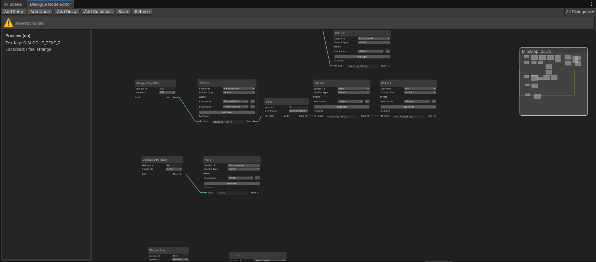
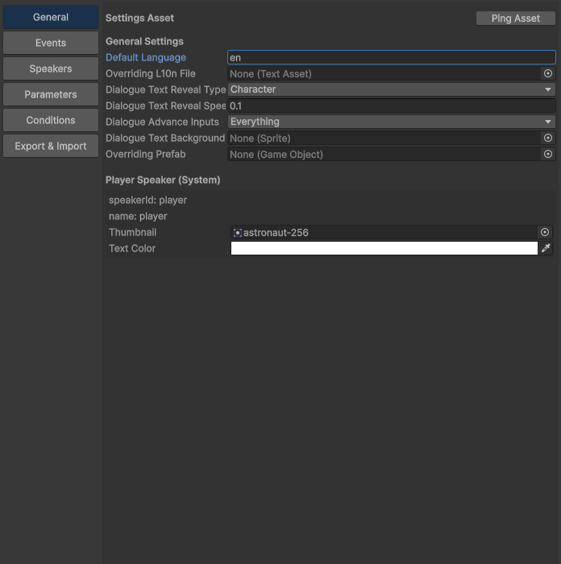
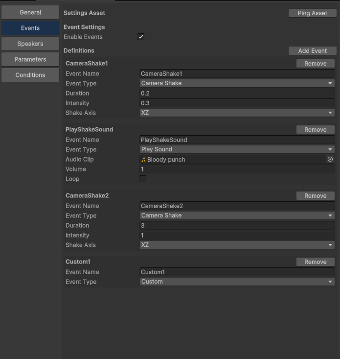
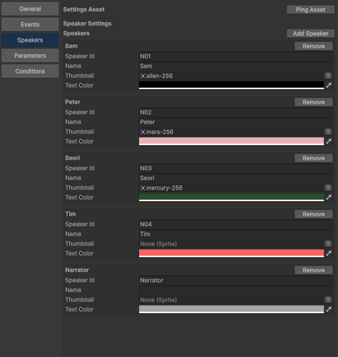
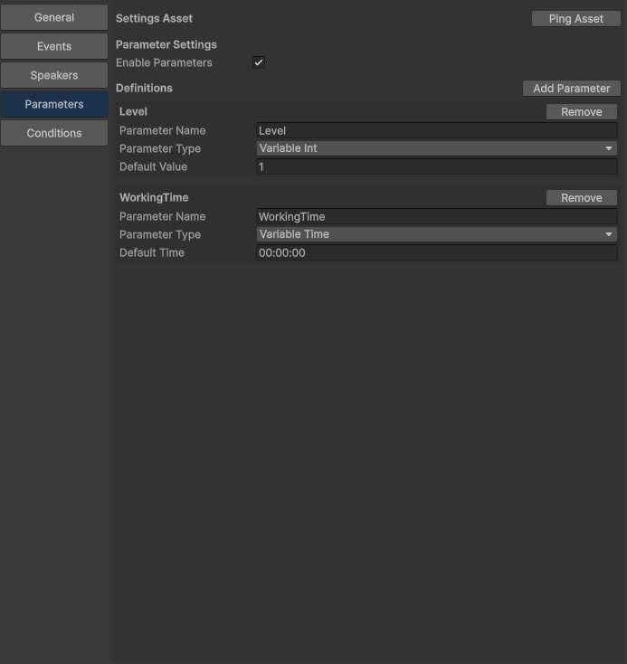
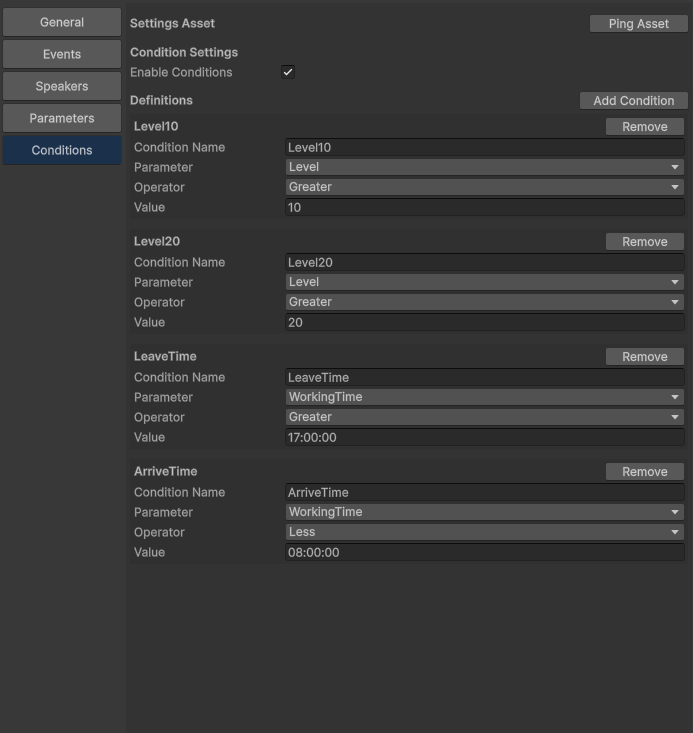

# DialogueEngine Editor Guide

대상: Dialogue Node Editor / Dialogue Engine Manager Editor

이 문서는 실제 에디터 화면 기준으로 각 화면의 역할과 사용 흐름을 정리한 GitHub용 Markdown 가이드입니다.

## 1. Dialogue Node Editor (GraphView)

경로: `DialogueEngine/Dialogue Node Editor`

대화 흐름을 노드 기반으로 편집하고 `Save`로 JSON에 저장하는 화면입니다.

- 상단 Toolbar: `Add Entry`, `Add Node`, `Add Delay`, `Add Condition`, `Save`, `Refresh`
- 좌측 Preview 패널: 선택한 Text Node의 `textKey`와 기본 언어 기준 미리보기 표시
- 우측 상단 `dialogueId` 필터: 특정 대화만 골라서 표시
- 노드 연결로 흐름(`next` / `choice` 분기) 구성
- 변경 사항이 있으면 저장 상태 알림 표시, 저장 후 성공/경고/에러 알림 표시



## 2. Node Editor 작성 가이드

1. `Add Entry` 버튼으로 대화의 시작 노드(Entry)를 생성하고 `dialogueId`를 입력합니다.
2. 우측 상단의 `dialogueId` 드롭다운에서 특정 대화를 선택하면 해당 대화에 연결된 노드만 집중해서 볼 수 있습니다.
3. `Add Node` 버튼으로 대사(Text) 노드를 생성하고 `textKey`, `speaker`, 필요 시 `event`를 설정합니다.
4. 특정 `dialogueId` 필터 상태에서 `Add Node`, `Add Delay`, `Add Condition`를 생성하면 새 노드에 현재 `dialogueId`가 자동으로 들어갑니다. `Add Entry`는 예외입니다.
5. Entry의 `next` 출력 포트를 Text Node의 `input`으로 연결해 시작 흐름을 만듭니다.
6. 대사 사이를 계속 연결해 기본 진행 경로를 구성합니다. 분기가 필요하면 `isChoice`를 켜고 선택지와 분기 포트를 연결합니다.
7. 대기/연출이 필요하면 `Add Delay`로 Delay 노드를 추가해 중간에 삽입합니다.
8. 조건 분기가 필요하면 `Add Condition`으로 Condition 노드를 만들고 `true` / `false` 출력 각각을 다음 노드에 연결합니다.
9. `Save`를 눌러 JSON으로 저장합니다. 저장 후에는 상태 메시지로 성공/경고/오류를 확인합니다.
10. 파일을 다시 읽어 그래프를 최신 상태로 동기화하려면 `Refresh`를 사용합니다.
11. 노드를 클릭하면 좌측 Preview 패널에 해당 노드의 `textKey`와 기본 언어 번역문이 표시되어 실제 출력 문구를 빠르게 확인할 수 있습니다.

팁: 먼저 Entry와 핵심 Text Node들을 배치해 메인 흐름을 만든 뒤, Delay / Condition / Choice를 추가하면 구조를 관리하기 쉽습니다.

## 3. Dialogue Engine Manager Editor

경로: `DialogueEngine/Dialogue Engine Manager`

프로젝트 전역 설정(ScriptableObject)과 런타임 데이터 정의를 관리하는 화면입니다.

### General

언어, 텍스트 출력 방식, 진행 입력, 기본 UI 프리팹 등 엔진 전역 설정을 다룹니다.

| Field | Description |
|---|---|
| `defaultLanguage` | 기본 언어 코드(예: `ko`, `en`) |
| `Overriding L10n File` | 기본 `DialogueTextData.json` 대신 사용할 로컬라이제이션 JSON 파일(`TextAsset`). 지정 시 Node Preview와 런타임 모두 이 파일을 우선 사용 |
| `dialogueTextRevealType` | 텍스트 출력 방식(즉시 / 글자 단위 / 단어 단위) |
| `dialogueTextRevealSpeed` | 텍스트 출력 속도(간격) |
| `dialogueAdvanceInputs` | 진행 입력 키 조합(마우스 좌클릭 / `Space` / `Enter`) |
| `dialogueTextBackground` | 대화 배경 스프라이트 |
| `Overriding Prefab` | 기본 TextBox를 대체할 프리팹(`IDialogueEngineTextBox` 구현 필요) |
| `Player Speaker(System)` | `speakerId/name=player` 고정, `thumbnail`과 `textColor` 설정 |



### Events

이벤트 이름과 타입(CameraShake, CameraMove, Sound 등)별 필드를 정의합니다.

| Field | Description |
|---|---|
| `enableEvents` | 이벤트 시스템 사용 여부 |
| `eventName` | 노드에서 참조할 이벤트 키 이름 |
| `eventType` | 이벤트 동작 타입 |
| `CameraShake` | `duration`, `intensity`, `shakeAxis` |
| `CameraMove` | `targetName`, `targetPosition`, `duration` |
| `PlaySound` | `audioClip`, `volume`, `loop` |
| `StopSound` | `targetName`, `fadeOut` |



### Speakers

`speakerId`, 이름, 썸네일, 텍스트 색상 등 화자 표시 정보를 정의합니다.

| Field | Description |
|---|---|
| `speakerId` | 노드에서 선택하는 화자 식별자(고유 권장) |
| `name` | UI에 표시할 화자 이름 |
| `thumbnail` | 화자 썸네일 |
| `textColor` | 화자 대사 텍스트 색상 |
| `player` | 이 탭에서 편집하지 않고 General 탭의 Player Speaker 영역에서 관리 |



### Parameters

조건 평가에 사용할 파라미터 타입과 기본값을 설정합니다.

| Field | Description |
|---|---|
| `enableParameters` | 파라미터 시스템 사용 여부 |
| `parameterName` | 파라미터 키 이름 |
| `parameterType` | `Bool` / `Int` / `Float` / `String` / `Time` 타입 |
| `Default Value` | 타입별 기본값 |
| `VariableTime` | 기본값은 `hh:mm:ss` 형식만 허용 |



### Conditions

미리 정의된 파라미터 기준으로 조건식을 만들고 분기 로직에 사용합니다.

| Field | Description |
|---|---|
| `enableConditions` | 조건 시스템 사용 여부 |
| `conditionName` | Graph의 Condition Node에서 선택할 조건 이름 |
| `Parameter` | Parameters 탭에서 미리 정의한 항목만 선택 가능 |
| `Operator` | 타입별 허용 비교 연산자 자동 제한 |
| `Value` | 선택된 Parameter 타입에 맞는 비교값 입력 |



## 4. L10N 파일 구조와 Override

기본 대사 번역 파일 경로:

`Assets/DialogueEngine/Resources/DialogueEngineResources/DialogueTextData.json`

기본 구조는 `textKey`를 키로 사용하고, 내부에 언어 코드별 문자열을 넣는 형태입니다.

```json
{
  "GENERAL_HELLO": {
    "ko": "안녕하세요",
    "en": "Hello"
  },
  "NPC_GREETING": {
    "ko": "어서 오세요",
    "en": "Welcome"
  }
}
```

`General` 탭의 `Overriding L10n File`에 다른 `TextAsset` JSON을 지정하면 기본 `DialogueTextData.json` 대신 해당 파일을 사용합니다.

- Node Editor의 Preview 패널도 override 파일 기준으로 번역문을 표시합니다.
- 런타임 `DialogueEngineManager.Init` 이후 실제 대사 출력도 override 파일 기준으로 동작합니다.
- 비워두면 기본 파일인 `DialogueTextData.json`을 사용합니다.

## 5. Export & Import

경로: `DialogueEngine/Dialogue Engine Manager` -> `Export & Import` 탭

설정 데이터와 대화 JSON을 외부 파일로 내보내거나 다시 불러오는 기능입니다.

| Button | Description |
|---|---|
| `Export All` | Manager 설정과 Dialogue JSON을 하나의 파일로 함께 내보냅니다 |
| `Export Manager` | `General / Events / Speakers / Parameters / Conditions` 설정만 내보냅니다 |
| `Export Dialogue` | GraphView의 `DialogueData.json` 내용만 내보냅니다 |
| `Import` | `Export All` 또는 `Export Manager`로 만든 JSON을 읽어 Manager 설정을 복원합니다 |

Export 시 Unity Object 참조(예: 썸네일, 사운드, 프리팹)는 에셋 경로 문자열로 저장됩니다. Import 시 해당 경로의 에셋이 존재하면 다시 연결하고, 없으면 비워둡니다.

- `Export All` 파일에는 settings와 dialogue가 같이 들어갑니다.
- 현재 `Import`는 Manager 설정 복원 기준입니다. 즉 `General / Events / Speakers / Parameters / Conditions`를 복원합니다.
- 잘못된 포맷의 JSON은 기존 설정을 지우지 않고 import를 중단합니다.

## 6. 권장 작업 순서

1. Manager Editor에서 Speakers / Parameters / Conditions / Events를 먼저 정의
2. Node Editor에서 Entry부터 대화 흐름 노드 그래프 구성
3. 필요한 노드에 condition / event / choice 설정 후 `Save`
4. 런타임에서 `DialogueEngineManager.Init` 후 `StartDialogue(dialogueId)` 호출

## 7. 관련 문서

- API 문서: [DialogueEngineManager_API.html](DialogueEngineManager_API.html)
